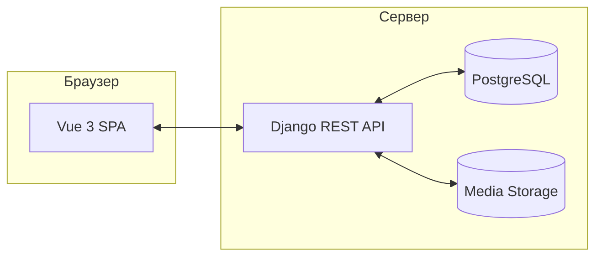

# ФотоТочка — full-stack маркетплейс стоковых фото

Django 5 + Vue 3, Docker, E2E-тесты, автоматический деплой на VDS. Дипломный проект, который я сделал сам — от Figma до Nginx на сервере.

**Кому:** если вам нужен сайт / маркетплейс / веб-приложение и вы ищете разработчика, который сделает всё от начала до конца.

**Кто сделал:** [@nikondrat](https://t.me/nikondrat)

---

## Стек

| Слой | Технологии |
|------|-----------|
| **Frontend** | Vue 3, Vite, TypeScript, Vue Router |
| **Backend** | Django 5, DRF, JWT, Whitenoise |
| **QA / Tests** | Playwright (E2E + Visual), Pytest |
| **Infrastructure** | Docker, Postgres, Nginx, Bash CLI |

## Архитектура

## Возможности

| Область | Что реализовано |
|---------|----------------|
| **Витрина** | Главная с подборками, поиск, блоки доверия |
| **Каталог** | Фильтры, пагинация, избранное |
| **Карточка** | Детали, теги, похожие через API |
| **Профиль** | JWT-авторизация, личный кабинет |
| **Админка** | Панель на Vue + API: статистика, авторы, категории |
| **Качество** | Pytest, Playwright E2E + Visual Regression |
| **Деплой** | Docker → VDS: Nginx, Gunicorn, Postgres, автоматический скрипт |

## Что это говорит обо мне

**Я умею строить готовые продукты.** Не прототип, не демку — работающий сайт с бэкендом, базой, тестами и деплоем. От Figma до Nginx.

**Production не начинается после вуза.** Docker, CI, Playwright, Nginx, VDS — я поднял инфраструктуру сам, без курсов и наставников.

**Full-stack без потери контекста.** Фронт и бэк пишет один человек — API и UI спроектированы как единое целое, а не две половины, которые стыкуют неделями.

**Это диплом.** Формальное образование + реальные проекты. Я не просто учусь — я делаю.

## Контакты

Нужен сайт, маркетплейс или веб-приложение? Давайте созвонимся на 15 минут — я покажу, как это устроено, и обсужу вашу задачу. Без обязательств.

- Telegram: [@nikondrat](https://t.me/nikondrat)
- Email: nikondrator@icloud.com
- GitHub: [nikondrat/phototochka](https://github.com/nikondrat/phototochka)
