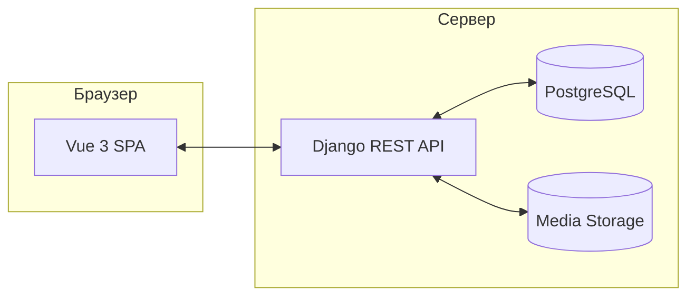

# ФотоТочка (phototochka)

**RU:** полноценный **Fullstack** дипломный проект маркетплейса стоковых фотографий: витрина, каталог с фильтрами, карточка фото, личный кабинет пользователя и панель администратора. Реализовано на **Django 5** и **Vue 3** с автоматизированным тестированием (E2E) и Docker-инфраструктурой.

**EN:** a full-featured **Fullstack** stock-photo marketplace project — built with **Django 5** and **Vue 3**. Includes catalog, user profile, admin panel, automated E2E testing (Playwright), and Docker-ready infrastructure.

---

## Интерфейс


| Главная | Каталог | Карточка фото |
| ------- | ------- | ------------- |
| Главная | Каталог | Карточка      |


| Новинки на главной | Лента каталога | Блок доверия |
| ------------------ | -------------- | ------------ |
| Новинки            | Лента          | Доверие      |


| Похожие фото |
| ------------ |
| Похожие      |


> Скриншоты можно переснять: `./photo build`, затем в одном терминале `./photo up`, в другом — `cd frontend && npm run capture:readme` (нужен `npx playwright install chromium`).

---

## Оглавление

- [Возможности](#возможности)
- [Стек](#стек)
- [Архитектура](#архитектура)
- [Быстрый старт](#быстрый-старт)
- [Деплой на VDS](#деплой-на-vds)
- [Переменные окружения](#переменные-окружения)
- [Локальные материалы](#локальные-материалы)
- [Безопасность](#безопасность)

---

## Возможности


| Область           | Что реализовано                                                       |
| ----------------- | --------------------------------------------------------------------- |
| **Витрина**       | Главная с динамическими подборками, поиском и блоками доверия.        |
| **Каталог**       | Реальные данные из БД, фильтры, избранное, пагинация.                 |
| **Карточка фото** | Детали, теги, похожие работы (через API).                             |
| **Профиль**       | JWT-авторизация, редактирование данных, личный кабинет.               |
| **Админка**       | Панель управления статистикой, авторами и категориями (на Vue + API). |
| **Качество**      | Pytest (Backend), Playwright E2E и Visual Regression тесты.           |


---

## Стек


| Слой               | Технологии                                 |
| ------------------ | ------------------------------------------ |
| **Frontend**       | Vue 3, Vite, TypeScript, Vue Router        |
| **Backend**        | Django 5, DRF, JWT (SimpleJWT), Whitenoise |
| **QA / Tests**     | Playwright (E2E & Visual), Pytest (API)    |
| **Infrastructure** | Docker, Postgres, Bash CLI Orchestrator    |


---

## Архитектура




---

## Быстрый старт

Все команды — через CLI `./photo` в корне репозитория.

### Требования

- **Node.js 20+**
- **Docker Desktop** (для сценария «один шаг») или **Python 3.12+** для полностью локального режима
- (Опционально) Python-venv, если не используете Docker

### Один шаг: сайт + API + демо-данные

Нужен запущенный **Docker Desktop**.

**Рабочая директория — корень репозитория** (папка `graduation/`, где лежит файл `photo`).  
Если вы в `backend/`, либо `cd ..`, либо запускайте **`./photo start`** (обёртка [backend/photo](backend/photo) поднимается в корень).

```bash
cd /путь/к/graduation
chmod +x photo backend/photo   # один раз, если zsh: permission denied
./photo start
```

Скрипт: создаст `.env` при отсутствии, **соберёт образ**, поднимет Postgres и Django, **применит миграции**, выполнит **seed** (кроме `SKIP_SEED=1`), поставит npm-зависимости и запустит **Vite** на [http://localhost:5173](http://localhost:5173) (API проксируется на порт 8000). Останов: `Ctrl+C` в терминале, затем при желании `./photo down`.

**Если `ReadTimeout` / `No matching distribution found for Django` при `docker build`** — это **сбой сети к PyPI** (таймаут, SSL, фильтр), а не «нет пакета». Повторите сборку позже, включите стабильный VPN или задайте в **корневом** `.env` строку `PIP_INDEX_URL=https://pypi.org/simple` и снова `docker compose build --no-cache` / `./photo start`. Образы стали **легче**: добавлен [backend/.dockerignore](backend/.dockerignore) (раньше в контекст попадал `.venv` и десятки мегабайт).

*Первая сборка после `git pull` с новыми `requirements.txt`: уже включено в `./photo start`. Чтобы пропустить `docker build`, можно `NO_BUILD=1 ./photo start`.*

### Только бэкенд в Docker (без фронта)

```bash
./photo up
./photo seed
```

### Локально без Docker (два терминала)

```bash
./photo dev:back    # venv при первом запуске создаётся сам; миграции; :8000
```

```bash
./photo dev:front   # :5173
```

### Наполнение демо-данными

```bash
./photo seed
```

Если крутится **Docker** — сид идёт в **Postgres** в контейнере. Если Docker выключен — в локальный `backend` с SQLite/вашим `DATABASE_URL` из `backend/.env`.

### Запуск тестов

```bash
./photo test:full
```

Прогонит полный цикл: тесты бэкенда, проверку типов фронтенда и сквозные тесты Playwright.

---

## Деплой на VDS

Автоматизированный деплой на Linux-сервер через `rsync` + `ssh` + Docker.

### 1. Создайте сервер (Timeweb и др.)

При создании VDS (Ubuntu 22.04+) вставьте скрипт в поле **Cloud-init**:

```bash
cat scripts/cloud-init.sh
```

Он установит Docker, UFW (22/80/443) и swap 2GB.

### 2. Настройте SSH

```bash
ssh-copy-id root@<IP-сервера>
```

### 3. Настройте `PHOTO_DEPLOY_HOST` в `.env`

```bash
echo 'PHOTO_DEPLOY_HOST=<IP-сервера>' >> .env
```

### 4. Запустите деплой

```bash
./photo deploy
```

Скрипт:
1. 🔨 Собирает **фронт** (`npm run build`) и **статику** (`collectstatic`) локально
2. 📤 Синхронизирует код на VDS
3. 🔐 Генерирует production `.env` (секретный ключ, пароль админа)
4. 🐳 Собирает Docker-образы на VDS (Postgres + Django + Nginx)
5. 🔄 Миграции + демо-данные
6. 🚀 Запуск: **Nginx (:80)** → Django (Gunicorn) → PostgreSQL

### Архитектура продакшена

```
Пользователь ──▶ Nginx (:80)
                    ├── /        → frontend/dist/index.html (SPA)
                    ├── /api/*   → backend:8000 (Django)
                    ├── /admin/* → backend:8000 (Django)
                    ├── /static/* → backend/staticfiles/
                    └── /media/*  → Docker volume (фото)
```

Домен не обязателен — всё работает по IP. Готово к HTTPS (добавьте `server` с SSL в `scripts/nginx.conf` при появлении домена).

### Переменные деплоя

| Переменная | По умолчанию | Описание |
|---|---|---|
| `PHOTO_DEPLOY_HOST` | — | IP или домен VDS (обязательно) |
| `PHOTO_DEPLOY_USER` | `root` | SSH-пользователь |
| `PHOTO_DEPLOY_PATH` | `/opt/phototochka` | Путь на сервере |
| `PHOTO_DEPLOY_SKIP_BUILD` | `0` | `=1` пропустить локальную сборку |
| `PIP_INDEX_URL` | — | Зеркало PyPI (если таймауты) |

---

## Переменные окружения

Копируйте из `[.env.example](./.env.example)`.


| Переменная          | Назначение                                                   |
| ------------------- | ------------------------------------------------------------ |
| `VITE_API_URL`      | URL API бэкенда (в dev — пусто для проксирования).           |
| `DJANGO_SECRET_KEY` | Секретный ключ Django.                                       |
| `DATABASE_URL`      | Строка подключения к БД (Postgres).                          |
| `SEED_ADMIN_EMAIL`  | Email администратора для первичного сидирования.             |
| `PHOTO_DEPLOY_HOST` | Хост для автоматизированного деплоя.                         |
| `CELERY_BROKER_URL` | URL Redis (если пусто — Celery в eager, без воркера).        |
| `REDIS_URL`         | Кэш Django; вместе с `SHOWCASE_CACHE_SECONDS` — кэш витрины. |
| `AWS_*`             | S3: при задании ключа, бакета и секрета — хранение медиа.    |


Фоновая обработка фото (WebP/AVIF после загрузки): при непустом `CELERY_BROKER_URL` запустите воркер:

```bash
cd backend && . .venv/bin/activate && celery -A config worker -l info
```

---

## Локальные материалы

Каталог `docs/` и настройки `.cursor/` **не входят** в git (см. `.gitignore`). В репозитории остаются только исходный код, тесты и конфигурации для развертывания.

---

## Безопасность

- **JWT Auth**: Используется безопасная передача токенов с механизмом Refresh.
- **IsAdminUser**: Все административные эндпоинты защищены проверкой прав на стороне бэкенда.
- **Rate Limiting**: Рекомендуется настроить на уровне Nginx перед деплоем в прод.

---

© 2026 ФотоТочка. Дипломный проект.